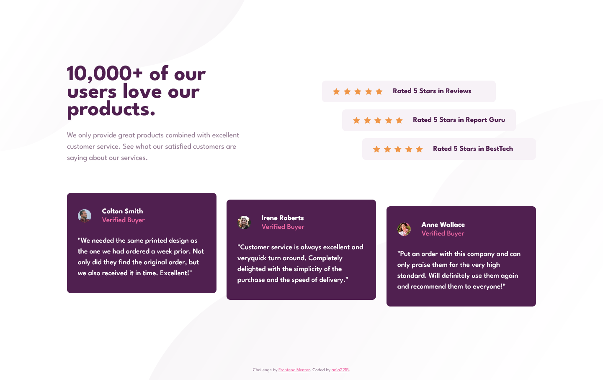

# Frontend Mentor - Social proof section solution

This is a solution to the [Social proof section challenge on Frontend Mentor](https://www.frontendmentor.io/challenges/social-proof-section-6e0qTv_bA). Frontend Mentor challenges help you improve your coding skills by building realistic projects.

## Table of contents

- [Overview](#overview)
  - [The challenge](#the-challenge)
  - [Screenshot](#screenshot)
  - [Links](#links)
- [My process](#my-process)
  - [Built with](#built-with)
  - [Continued development](#continued-development)
- [Author](#author)
- [Acknowledgments](#acknowledgments)

## Overview

### The challenge

Users should be able to:

- View the optimal layout for the section depending on their device's screen size

### Screenshot

### Links

- Solution URL: [GitHub](https://ania221b.github.io/social-proof-section-frontend-mentor/)
- Live Site URL: [GitHub Pages](https://ania221b.github.io/social-proof-section-frontend-mentor/)

## My process

### Built with

- Semantic HTML5 markup
- CSS custom properties
- Flexbox
- CSS Grid
- Mobile-first workflow

### Continued development

- Responsive design - figuring out how to reuse code and learning how not to overcomplicate things

## Author

- Frontend Mentor - [@yourusername](https://www.frontendmentor.io/profile/yourusername)

## Acknowledgments

At first I used `justify-self` and `align self` but changed that to `transform: translateX()` and `transform: translateY()` after watching part of Kevin Powell's video: [Taking on a FrontEndMentor.io challenge!](https://www.youtube.com/watch?v=K27WULzr2P8). The result was better with transforms.
